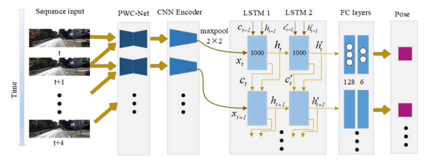

# EVOLVE: Event-based Visual Odometry with Latent Vector Estimation

**EVOLVE** is a deep learning model for estimating **6-DoF egomotion** (translation and rotation in 3D) from **event-based optical flow**. Built for robust visual odometry, EVOLVE combines unsupervised representation learning with temporal modeling to predict camera motion over time.

## What It Does

EVOLVE predicts how a camera moves — in 3D space — using only sequences of **optical flow computed from event data**. At each timestep, it outputs a 6-DoF relative pose estimate:

[tx, ty, tz, wx, wy, wz]

Where:
- `t`: translation (meters)
- `w`: rotation (Euler angles in degrees)

---

## How It Works

EVOLVE is trained in two stages:

### 1. **Unsupervised Flow Encoding**
We begin by training a **convolutional encoder** on event-based optical flow (generated using [E-RAFT](https://arxiv.org/abs/2203.08864)).

- The encoder is trained **unsupervised** using a decoder.
- The goal is to reconstruct the original optical flow from its latent representation.
- This forces the encoder to learn meaningful motion features without any ground-truth supervision.

### 2. **Recurrent Motion Estimation**
After pretraining, the encoder is reused as a fixed feature extractor in a new pipeline:

- The latent encodings of each flow frame are passed into a **2-layer LSTM** to model temporal dynamics.
- The final LSTM outputs go through **fully connected layers** to predict the **relative pose** between frames.

---

## Event-Based Input

Unlike conventional visual odometry models that use grayscale or RGB video, EVOLVE operates on **event data** — sparse, high-temporal-resolution streams of brightness change. Optical flow is first estimated using **E-RAFT**, then passed into the EVOLVE pipeline.

This makes EVOLVE well-suited for:
- Low-light conditions
- Fast motion
- High dynamic range environments

---

## Applications

- Event-based Visual Odometry
- Drone & Robot Navigation in Extreme Conditions
- SLAM for Neuromorphic Cameras
- AR/VR Headset Tracking with Low Latency

---

## Why this matters

Traditional visual odometry relies on handcrafted features and frame-based images. EVOLVE learns motion representations **directly from events** — enabling robust, low-latency motion estimation in challenging scenarios.

By separating the learning of **latent motion features** from the modeling of **temporal dependencies**, EVOLVE offers a flexible and data-efficient framework for event-based egomotion estimation.

---
